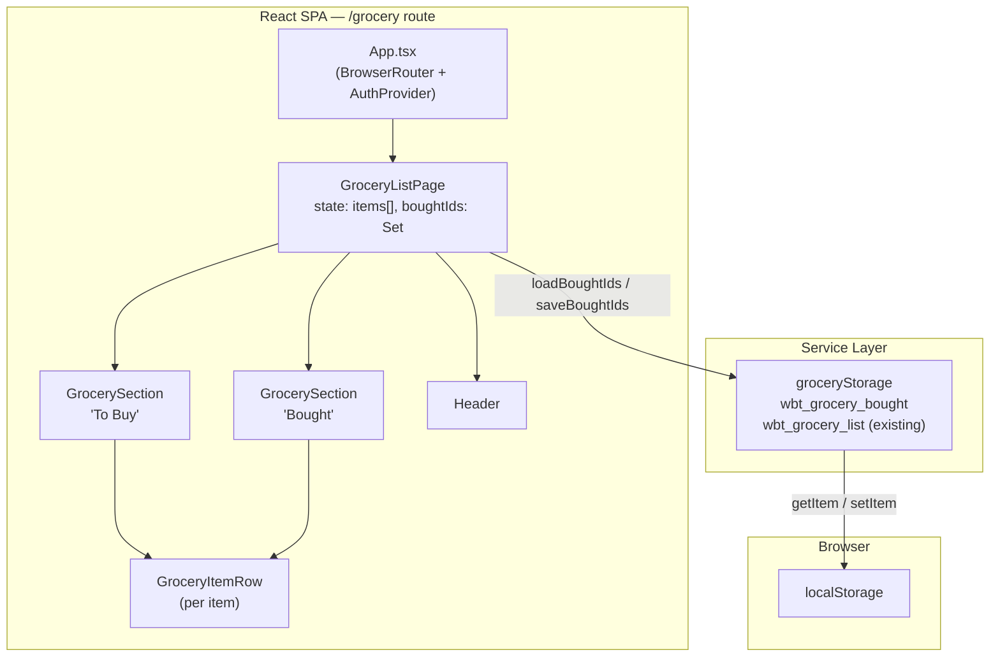

# System Architecture: Mark Grocery Item as Bought

> Generated: 2026-06-01 | Version: 1.0 | Ticket: KAN-3

---

## 1. Overview

This document describes the architecture for the **Mark Grocery Item as Bought** feature (KAN-3) within the Remote Wellbeing Tracker's Grocery List screen (`/grocery`).

The feature adds a stateful toggle mechanism to each grocery item that moves it between a "To Buy" section and a "Bought" section. Bought state is persisted client-side in `localStorage` with no server round-trip. Visually, bought items receive strikethrough and reduced opacity. Both sections always render with live count badges and appropriate empty-state messages.

**Scope boundary:** This is a pure client-side feature. No server routes, database tables, or API contracts are changed. The entire change surface lives inside `client/src/`.

> **REVIEWER NOTE (CI-01):** The current `GroceryListPage.tsx` renders all items in an HTML `<table>` with five columns. This architecture describes a two-section card layout using `GrocerySection` and `GroceryItemRow` components. These are structurally incompatible DOM layouts — implementing this feature requires replacing the table entirely, not extending it. The implementation plan must treat the table-to-card refactor as a prerequisite step and scope it explicitly. See `docs/design-review.md` Critical Issue CI-01. <!-- Updated by design-reviewer -->

---

## 2. Architecture Pattern

### Pattern: Component-State + Service-Layer (Client-Only)

The existing client follows a **React SPA with a thin service layer** pattern. State lives in React components (via `useState`), cross-cutting concerns (auth, notifications) are extracted into Context providers and custom hooks, and raw browser API access (localStorage, Notifications API) is encapsulated in dedicated service modules under `client/src/services/`.

This feature adopts the same pattern:

| Concern | Where it lives |
|---|---|
| Bought-state toggle logic | `GroceryListPage` component state (`useState`) |
| localStorage read/write | New `groceryStorage` service module |
| Derived list partitioning | Computed from state inside the component (no separate store) |
| Visual presentation | Inline Tailwind classes on item rows |

**Why not a Context / global store?** The bought state belongs exclusively to the Grocery List page. No other page or component consumes it. Lifting it into a Context would add indirection with no benefit. React local state is the right scope.

**Why not a custom hook?** A custom hook (`useGroceryBoughtState`) is a viable extraction point, but the bought-state logic (a single `Set<string>` toggled by id, persisted via a service call) is simple enough that it does not warrant a separate hook at this story's scope. If the grocery feature grows (filters, bulk actions), extraction to a hook becomes the natural next step.

**Why not Redux / Zustand?** No existing global state manager is used in the project. Adding one for a single local feature would be disproportionate.

**Trade-off acknowledged:** Keeping bought state inside `GroceryListPage` means the component's responsibilities grow slightly. The mitigation is to extract child components (`GrocerySection`, `GroceryItemRow`) that receive props, keeping `GroceryListPage` as a thin coordinator rather than a monolithic render tree.

---

## 3. Key Components

| Component | Responsibility | Technology | Interfaces |
|---|---|---|---|
| `GroceryListPage` | Orchestrates all grocery state (items + bought set); drives section rendering | React 18 / TypeScript | Reads from `groceryStorage`; renders `GrocerySection` x 2 |
| `GrocerySection` | Renders one labelled section (heading + count badge + item list or empty state) | React 18 / TypeScript | Props: `title`, `items`, `emptyMessage`, `onToggle` |
| `GroceryItemRow` | Renders a single grocery item with toggle control; applies bought visual styles | React 18 / TypeScript | Props: `item`, `bought: boolean`, `onToggle`, `onEdit`, `onDelete` |
| `groceryStorage` | Encapsulates all `localStorage` read/write for bought state; wraps calls in try/catch | TypeScript (no React) | `loadBoughtIds(): Set<string>`, `saveBoughtIds(ids: Set<string>): void` |
| `GroceryItem` type | Shared data shape for a grocery item (id, name, quantity, expiryDate) | TypeScript interface | Defined in `client/src/types.ts` (shared domain types file) — imported by `GroceryListPage`, `GrocerySection`, and `GroceryItemRow` <!-- Updated by design-reviewer: type location resolved from ambiguous "or promoted to types.ts" to a firm decision; GroceryItem is referenced by 3+ components and belongs alongside User, WellbeingLog, etc. in the shared types file. See design-review.md CI-02, D-01. --> |

### 3.1 GroceryListPage

- **Responsibility**: Owns the two state atoms — `items: GroceryItem[]` and `boughtIds: Set<string>` — and all mutation handlers (`handleAdd`, `handleDelete`, `handleToggleBought`). Computes derived `toBuyItems` and `boughtItems` arrays from those atoms on every render. Persists both to `localStorage` via their respective storage keys on every change.
- **Technology**: React `useState`, `useEffect`. TypeScript.
- **Key Interfaces**: Imports `groceryStorage.loadBoughtIds` and `groceryStorage.saveBoughtIds`. Renders `<GrocerySection>` twice (once for "To Buy", once for "Bought").
- **Dependencies**: `groceryStorage`, `GrocerySection`, `GroceryItemRow`, `Header`.

### 3.2 GrocerySection

<!-- Updated by design-reviewer: Removed redundant `count` and `boughtIds` props. `GroceryListPage` passes pre-filtered item arrays to each section, so `count` is always `items.length` — no need to pass it separately. `boughtIds` is also redundant at this level; `GroceryItemRow` receives `bought: boolean` directly, computed in `GroceryListPage` before passing to the section. See design-review.md SC-03, D-02. -->

- **Responsibility**: Renders the heading (`<h2>`) with count badge derived from `items.length`, and either the list of `GroceryItemRow` components or the empty-state message. Has no internal state.
- **Technology**: React functional component, TypeScript.
- **Key Interfaces**:
  - Props: `title: string`, `items: GroceryItem[]`, `emptyMessage: string`, `onToggle(id: string): void`, `onEdit(item: GroceryItem): void`, `onDelete(id: string): void`
  - The count badge is rendered as `{title} ({items.length})`. The `bought: boolean` prop on each row is computed in `GroceryListPage` and passed through to `GroceryItemRow` via this component.
- **Dependencies**: `GroceryItemRow`.

### 3.3 GroceryItemRow

- **Responsibility**: Renders a single item row. Applies `line-through` and `opacity-50` Tailwind classes when `bought` is true. Renders the toggle `<button>` with correct `aria-label` (`"Mark <name> as bought"` / `"Mark <name> as not bought"`). Meets 44 x 44 CSS px minimum touch target via padding. Fires `onToggle(id)` on click, Enter, or Space.
- **Technology**: React functional component, TypeScript, Tailwind CSS.
- **Key Interfaces**:
  - Props: `item: GroceryItem`, `bought: boolean`, `onToggle(id: string): void`, `onEdit(item: GroceryItem): void`, `onDelete(id: string): void`
- **Dependencies**: Lucide React icons (`Check`, `Pencil`, `Trash2`).

### 3.4 groceryStorage (service module)

<!-- Updated by design-reviewer: `saveBoughtIds` return type changed from `void` to `WriteResult { success: boolean }` to match the established `notificationStorage` pattern. The initial caller may ignore the return value, but this keeps the service API consistent and preserves the option to surface a degraded-mode indicator in a future story without changing the service contract. See design-review.md SC-01, D-04. -->

- **Responsibility**: Provides a pure interface over `localStorage` for bought-state persistence. All `localStorage` calls are wrapped in `try/catch`; on failure the error is logged to `console.error` and the function returns a safe default (empty `Set` for load; `{ success: false }` for save). Follows the `wbt_` key convention: key is `wbt_grocery_bought`.
- **Technology**: Plain TypeScript — zero React dependencies, making it trivially testable without a DOM.
- **Key Interfaces**:
  - `loadBoughtIds(): Set<string>` — reads `wbt_grocery_bought` from localStorage, parses JSON array, returns as `Set<string>`. Returns empty Set on any error.
  - `saveBoughtIds(ids: Set<string>): WriteResult` — serialises the Set to a JSON array and writes to `wbt_grocery_bought`. Returns `{ success: true }` on success. Logs `console.error` on failure and returns `{ success: false }`; does not throw.
  - Key constant: `const BOUGHT_KEY = 'wbt_grocery_bought'` defined inside this module to prevent key-string typos.
- **Dependencies**: None (browser `localStorage` only).

---

## 4. Component Diagram



**Sequence: Toggle bought state**

```mermaid
sequenceDiagram
    actor User
    participant GIR as GroceryItemRow
    participant GLP as GroceryListPage
    participant GStore as groceryStorage
    participant LS as localStorage

    User->>GIR: click / Enter / Space on toggle button
    GIR->>GLP: onToggle(itemId)
    GLP->>GLP: setBoughtIds(prev => toggle itemId in Set)
    GLP->>GStore: saveBoughtIds(newBoughtIds)
    GStore->>LS: setItem('wbt_grocery_bought', JSON)
    alt localStorage available
        LS-->>GStore: ok
    else localStorage unavailable / full
        LS-->>GStore: throws
        GStore->>GStore: console.error(error)
        note over GStore: in-memory state already updated; no crash
    end
    GLP->>GLP: re-render (derive toBuyItems / boughtItems)
    GLP->>GS_BUY: updated props
    GLP->>GS_BOUGHT: updated props
    GS_BUY-->>User: item removed from To Buy section
    GS_BOUGHT-->>User: item appears in Bought section
```

---

## 5. Technology Stack

| Layer | Technology | Rationale |
|---|---|---|
| UI Framework | React 18 with TypeScript | Already in use; no new dependency |
| Styling | Tailwind CSS (existing utility classes) | `line-through`, `opacity-50`, `min-h-[44px]` cover all visual requirements with zero new CSS |
| Icons | Lucide React (existing) | `Check` icon is available for the toggle button; no new icon library needed |
| State Management | React `useState` (local component) | Bought state is page-local; no cross-component sharing required |
| Persistence | Browser `localStorage` via `groceryStorage` service | Requirement FR-17 mandates client-side-only persistence; matches existing `wbt_*` convention |
| Testing | Vitest + `@testing-library/react` + jsdom | Already installed; `groceryStorage` unit tests need no DOM, `GroceryItemRow` tests use RTL |
| Build / Dev | Vite 5 + tsc | Unchanged; no build config changes needed |
| Routing | React Router 6 (`/grocery` route) | Unchanged; feature lives entirely within the existing route |

---

## 6. Data Flow

### 6.1 Page Load / Rehydration (Happy Path)

1. User navigates to `/grocery` (or refreshes the browser).
2. React mounts `GroceryListPage`.
3. The `items` state initialiser calls `JSON.parse(localStorage.getItem('grocery-list') ?? '[]')` — existing behaviour, unchanged.
4. The `boughtIds` state initialiser calls `groceryStorage.loadBoughtIds()`, which reads `wbt_grocery_bought` from `localStorage` and returns a `Set<string>`.
5. The component renders: `toBuyItems = items.filter(i => !boughtIds.has(i.id))`, `boughtItems = items.filter(i => boughtIds.has(i.id))`.
6. Both `GrocerySection` components render their respective lists with correct count badges.

### 6.2 Page Load — localStorage Unavailable (Error Path)

1. Steps 1–2 as above.
2. `groceryStorage.loadBoughtIds()` catches the `SecurityError` / `DOMException`, logs `console.error`, returns an empty `Set`.
3. All items render in the "To Buy" section.
4. No user-visible error. The user can still toggle items; toggles update in-memory state correctly (FR-17, NFR-06).

### 6.3 Toggle Item to Bought (Happy Path)

<!-- Updated by design-reviewer: Added useRef mounted guard to step 5 to suppress spurious localStorage write on initial mount. See design-review.md SC-04, D-05. -->

1. User clicks (or presses Enter/Space on) the toggle button on an unbought item.
2. `GroceryItemRow.onToggle(item.id)` fires.
3. `GroceryListPage.handleToggleBought(id)` runs:
   ```
   setBoughtIds(prev => {
     const next = new Set(prev);
     next.has(id) ? next.delete(id) : next.add(id);
     return next;
   });
   ```
4. React schedules a re-render.
5. The `useEffect([boughtIds])` fires. A `useRef` mounted guard (`isMounted`) suppresses this effect on the initial mount, preventing a redundant write of the value just loaded from `localStorage`. On subsequent renders (i.e., real toggles), `groceryStorage.saveBoughtIds(boughtIds)` is called.
6. `groceryStorage` writes `JSON.stringify([...boughtIds])` to `localStorage` key `wbt_grocery_bought`.
7. The derived `toBuyItems` and `boughtItems` arrays are recomputed; React re-renders both `GrocerySection` components.
8. The item appears in the "Bought" section with `line-through` and `opacity-50` applied. Count badges update. DOM update completes within one render cycle — well within the 100 ms NFR-01 budget.

### 6.4 Toggle Item Back to Unbought (Happy Path)

1–5. Same as 6.3, but the item's id is already in `boughtIds`, so `next.delete(id)` runs instead of `next.add(id)`.
6. The item moves back to the "To Buy" section; strikethrough and opacity are removed.

### 6.5 Toggle — localStorage Write Fails (Error Path)

1–4. As in 6.3. In-memory `boughtIds` state is updated; React re-renders.
5. `useEffect` fires, calls `groceryStorage.saveBoughtIds(boughtIds)`.
6. `localStorage.setItem` throws (`QuotaExceededError` or `SecurityError`).
7. `groceryStorage` catches the error, calls `console.error(error)`, and returns.
8. In-memory state reflects the toggle correctly for the remainder of the session. On the next page load, the bought state reverts to the last successful `localStorage` snapshot — the data was never written. No crash, no user-visible error message (NFR-06).

### 6.6 Item Addition (Unchanged, Shown for Context)

Adding a new item via the form adds to `items` state only. It is placed in the "To Buy" section by default (not in `boughtIds`). The item's `id` (`crypto.randomUUID()`) is the stable identifier referenced by bought-state storage (BR-03, assumption from requirements section 8).

---

## 7. Non-Functional Considerations

### 7.1 Performance

- **Toggle latency**: The toggle mutates a `Set` (O(1) lookup + insert/delete), calls `setState` once, and triggers a single React re-render of the affected subtree. No API call, no debounce, no animation frame wait. Expected DOM commit time is under 5 ms on a mid-range device — well within the 100 ms NFR-01 budget.
- **`localStorage` write**: Synchronous, but executes in a `useEffect` (after paint), not in the event handler. The user sees the state change before the write completes.
- **Re-render scope**: `GroceryListPage` re-renders on every toggle; both `GrocerySection` components re-render. With a typical grocery list (< 100 items), this is negligible. If future growth demands it, `React.memo` on `GroceryItemRow` with a stable `onToggle` reference (via `useCallback`) is a ready optimisation.

### 7.2 Accessibility

- **`aria-label` on toggle button**: `"Mark <name> as bought"` when unbought; `"Mark <name> as not bought"` when bought. Updated synchronously on re-render — screen readers announce the updated label after toggle (AC-11, AC-12).
- **Keyboard operability**: The toggle is a `<button>` element, which natively receives Tab focus and fires `onClick` on Enter and Space. No additional `onKeyDown` handler required (FR-04, AC-09, AC-10).
- **Touch target**: The toggle button uses `min-h-[44px] min-w-[44px]` (or equivalent padding) to satisfy the 44 x 44 CSS px WCAG 2.5.5 requirement (NFR-03).
- **Colour is not the sole differentiator**: Strikethrough + opacity is the primary visual signal (not colour alone), which benefits users with colour vision deficiency.
- **Section headings**: `<h2>` elements give screen reader users landmark navigation within the page (FR-05, FR-08).

### 7.3 Storage Quota

- `wbt_grocery_bought` stores a JSON array of UUID strings. A UUID is 36 characters. At 1,000 items (an extreme upper bound for a personal grocery list), the array is approximately 37 KB — trivially within `localStorage`'s 5 MB typical quota.
- The `try/catch` guard in `groceryStorage.saveBoughtIds` ensures a full or disabled storage does not crash the session (NFR-06).

### 7.4 Animation

- Item movement between sections SHOULD use a 200 ms CSS ease transition (NFR-04). Because items change sections by being removed from one list and added to another (not animated DOM moves), a CSS `transition` on individual properties (opacity, transform) can be applied via Tailwind's `transition-all duration-200`. The state update is synchronous; the CSS transition plays after the DOM update and does not block interaction.
- **⚠️ Risk:** Native CSS transitions do not animate element removal from the DOM. If a smooth "slide out / slide in" animation is required, a library such as `react-transition-group` or `framer-motion` would be needed. At this story's scope, the requirement uses "SHOULD" (not "MUST"), and a simple opacity/transform transition on render is sufficient.

### 7.5 Browser Compatibility

- All APIs used (`localStorage`, `Set`, `crypto.randomUUID`, CSS `line-through`, `opacity`) are fully supported in the latest two stable versions of Chrome, Firefox, Safari, and Edge (NFR-05).
- `crypto.randomUUID()` requires a secure context (HTTPS or localhost). The dev server is localhost; production must be served over HTTPS.

### 7.6 Multi-Tab Behaviour

- Out of scope (requirements section 7). Each tab maintains its own in-memory state; if the user opens two tabs, the last tab to write `wbt_grocery_bought` wins. This is acceptable for the current story and consistent with how `grocery-list` state already behaves.

---

## 8. Architecture Decision Records (ADRs)

### ADR-001: Store Bought State as a Separate localStorage Key

- **Status**: Accepted
- **Context**: The existing `grocery-list` localStorage key stores the full `GroceryItem[]` array (id, name, quantity, expiryDate). Two design options were considered: (A) add a `bought: boolean` field to each `GroceryItem` and persist it inside the existing key, or (B) store bought ids in a separate key (`wbt_grocery_bought`) as an array of strings.
- **Decision**: Option B — separate key.
- **Consequences**:
  - Positive: The existing item-list persistence logic (`useEffect` writing `grocery-list`) is completely untouched. The bought-state service module has a single, narrow responsibility. The two concerns can evolve independently.
  - Positive: If the grocery item schema changes in the future (adding fields), bought state is unaffected.
  - Positive: The `groceryStorage` service is independently unit-testable without any knowledge of `GroceryItem` structure.
  - Negative: On page load, two `localStorage` reads occur instead of one (minor; both are synchronous and negligible).
  - Negative: A garbage-collection edge case exists: if an item is deleted from the grocery list, its id may linger in `wbt_grocery_bought`. This is harmless (the stale id is never matched against any item), but it means the bought key may accumulate orphaned ids over time. A cleanup step in `handleDelete` mitigates this — it should also remove the id from `boughtIds`.

### ADR-002: Derive Sections via Filter, Not Pre-sorted State

- **Status**: Accepted
- **Context**: Two options for splitting items into "To Buy" / "Bought" arrays: (A) maintain two separate state arrays (`toBuyItems`, `boughtItems`) and move objects between them on toggle, or (B) maintain a single `items` array (insertion order) plus a `boughtIds: Set<string>`, and derive the two display arrays via `.filter()` on every render.
- **Decision**: Option B — derive via filter.
- **Consequences**:
  - Positive: Insertion order (BR-03) is trivially correct — the source array is never reordered, only filtered.
  - Positive: Single source of truth. No risk of the two arrays drifting out of sync.
  - Positive: Toggling is O(1) Set mutation + one state update, not O(n) array manipulation.
  - Negative: Two `.filter()` passes on every render. Negligible at grocery-list scale (< 100 items). Can be memoised with `useMemo` if profiling ever flags it.

### ADR-003: Encapsulate localStorage in a Service Module (groceryStorage)

- **Status**: Accepted
- **Context**: The existing `GroceryListPage` directly calls `localStorage.getItem/setItem` inside its state initialiser and `useEffect`. The pattern for more complex persistence (notifications) uses dedicated service modules (`notificationStorage.ts`). Two options: (A) inline the bought-state localStorage calls directly in `GroceryListPage`, or (B) extract them to `client/src/services/groceryStorage.ts`.
- **Decision**: Option B — dedicated service module.
- **Consequences**:
  - Positive: Consistent with the `notificationStorage` pattern already established in the codebase.
  - Positive: The `try/catch` error handling and key constants are co-located in one place.
  - Positive: Unit tests for storage logic do not require mounting a React component; they can stub `localStorage` directly (matching the pattern in `notificationStorage.test.ts`).
  - Negative: Slightly more files. Acceptable — the module is small and focused.

### ADR-004: Extract GrocerySection and GroceryItemRow as Sub-Components

- **Status**: Accepted
- **Context**: The current `GroceryListPage` renders everything inline. Adding bought-state rendering (two sections, conditional styles, aria-labels) would significantly grow the component. Option A: keep everything inline. Option B: extract presentational sub-components.
- **Decision**: Option B — extract `GrocerySection` and `GroceryItemRow`.
- **Consequences**:
  - Positive: `GroceryListPage` remains a thin coordinator; testability of individual row and section rendering improves.
  - Positive: `GroceryItemRow` can be unit-tested in isolation for aria-label correctness, keyboard events, and visual class application.
  - Negative: Slightly more indirection. Justified by the complexity of the bought-state rendering logic.

### ADR-005: localStorage Key `wbt_grocery_bought` (not `grocery-bought`)

- **Status**: Accepted
- **Context**: The existing grocery-list key is `grocery-list` (without the `wbt_` prefix). Business rule BR-05 mandates the `wbt_` prefix for the bought-state key.
- **Decision**: Use `wbt_grocery_bought` for the new key. The existing `grocery-list` key is out of scope for renaming (separate story).
- **Consequences**:
  - Positive: Complies with BR-05 and the `wbt_` convention used by `notificationStorage`.
  - Negative: Minor inconsistency — `grocery-list` and `wbt_grocery_bought` use different prefix conventions. This is a pre-existing technical debt on the `grocery-list` key, not introduced by this story.

---

## 9. Assumptions and Open Questions

### Assumptions

1. **Stable item ids exist**: `GroceryListPage` already generates `crypto.randomUUID()` ids on item creation. These ids are persisted inside `grocery-list`. The bought-state key stores an array of these ids. This assumption is confirmed by the current code.

2. **`grocery-list` key is not renamed**: The existing key `grocery-list` (without `wbt_` prefix) is left unchanged. Only the new bought-state key follows the `wbt_` convention, per BR-05 and ADR-005.

3. **No animation library needed**: NFR-04 uses "SHOULD" language. CSS `transition` on `opacity` and `transform` is sufficient for this story. `framer-motion` or `react-transition-group` is not introduced.

4. **No `useMemo` / `useCallback` optimisation at this stage**: The grocery list is small. Memoisation is deferred until profiling indicates a need.

5. **Deleted-item id cleanup**: When `handleDelete` removes an item from `items`, it MUST also remove the item's id from `boughtIds` (and call `saveBoughtIds`). This is not called out explicitly in the requirements but is required for correctness (see ADR-001 consequences). The implementation plan must include this.

6. **Edit does not change item id**: The existing `saveEdit` function updates `name`, `quantity`, and `expiryDate` in place, preserving the item's id. Bought state therefore survives an edit operation — correct behaviour.

7. **Single browser tab**: Multi-tab synchronisation is explicitly out of scope (requirements section 7). `localStorage` `storage` event listeners are not implemented.

### Open Questions

All requirements-level questions were resolved before document finalisation (requirements section 9). The following are implementation-level clarifications for the implementing engineer:

- **OQ-01**: Should the `grocery-list` localStorage key be migrated to the `wbt_` prefix in this story or a separate chore ticket? (Current decision: out of scope, per requirements section 7.)
- **OQ-02**: Is there a design system token for the 44 px touch target, or should the implementation use an explicit `min-h-[44px] min-w-[44px]` Tailwind class? (Likely the latter — no token system is evident in the codebase.)
- **OQ-03**: Should `GrocerySection` and `GroceryItemRow` be placed in `client/src/components/` (shared) or remain co-located with `GroceryListPage`? Given they are grocery-specific and not shared across pages, co-location (`client/src/pages/`) or a sub-folder (`client/src/pages/grocery/`) is preferable.

---

## 10. Next Steps

<!-- Updated by design-reviewer: Steps reordered and expanded to call out the table-to-card layout migration (CI-01) and the handleDelete orphan cleanup (CI-03) as explicit named tasks. See design-review.md for full rationale. -->

1. **Design review**: COMPLETE — see `docs/design-review.md`. Status: APPROVED WITH CONDITIONS.
2. **Prerequisite — layout refactor**: The existing `GroceryListPage` renders items in an HTML `<table>`. Before wiring in bought-state, the table must be replaced with the two-section card layout. This is a structural refactor, not an additive change. The implementation plan must scope this explicitly.
3. **Prerequisite check**: Confirm `grocery-list` data in `localStorage` for existing users contains `id` fields — if any legacy data lacks ids, a migration guard is needed in the state initialiser.
4. **Add `GroceryItem` to `types.ts`**: Move the `GroceryItem` interface from its current inline definition in `GroceryListPage.tsx` to `client/src/types.ts` so all sub-components can import it from the shared types file (design decision D-01).
5. **Implement `groceryStorage` service** with unit tests mirroring `notificationStorage.test.ts` patterns. Ensure `saveBoughtIds` returns `WriteResult` (design decision D-04) and the key is defined as a named constant.
6. **Refactor `GroceryListPage`**: Replace table with two `GrocerySection` blocks; extract `GroceryItemRow`; wire `boughtIds` state, `handleToggleBought`, and the `useRef` mounted guard in the persistence `useEffect` (design decision D-05).
7. **Extend `handleDelete`**: In addition to removing the item from `items`, also remove the item's id from `boughtIds` and call `saveBoughtIds`. This is required for data integrity (design decision D-03). This step MUST be included in the implementation plan as a discrete named task.
8. **Integration tests**: Add `@testing-library/react` tests for:
   - `GroceryItemRow`: aria-label correctness when bought/unbought; keyboard toggle (Enter/Space).
   - `GroceryListPage`: section render, count badge updates, persistence round-trip.
   - `handleDelete` orphaned-id cleanup (verify `wbt_grocery_bought` no longer contains the deleted id).
   - Empty-state rendering when all items are bought (To Buy shows empty state) and when no items are bought (Bought shows empty state).
9. **Accessibility audit**: Verify toggle button touch target size and aria-label in a real browser with VoiceOver / NVDA.
10. **PR**: Open pull request against `main` after verification passes.
